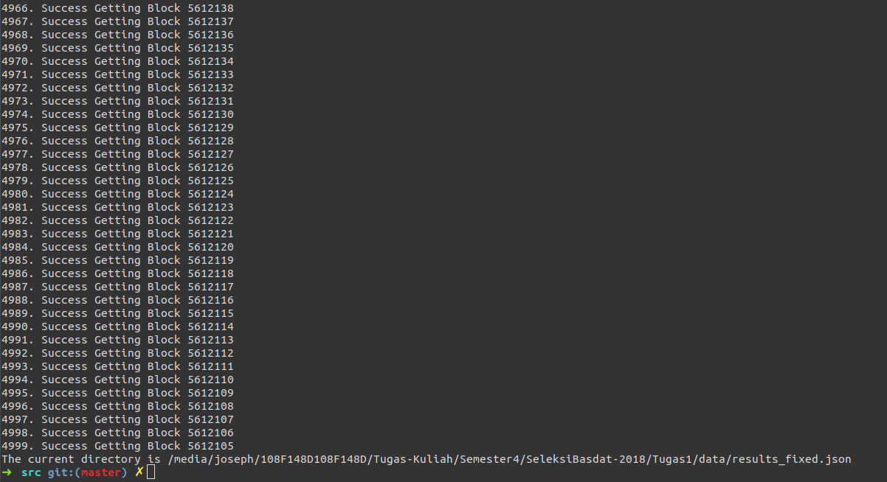
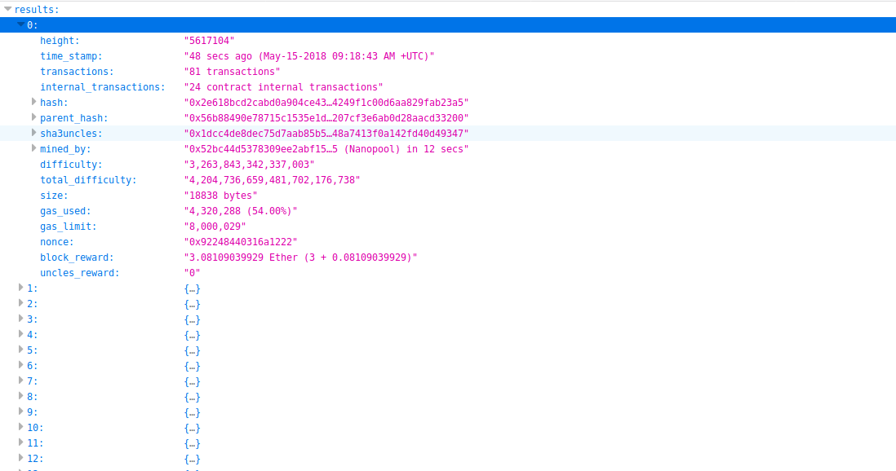

<h1 align="center">
  <br>
  Tugas 1 Seleksi Warga Basdat 2018
  <br>
  <br>
</h1>

<h2 align="center">
  <br>
  Data Scraping - Ethereum Scrapper
  <br>
  <br>
</h2>


### Descriptions

Sebuah program yang melakukan *scraping* data terhadap data block yang ada pada blockchain **Ethereum** melalui website [etherscan](https://etherscan.io/). Data yang diambil disesuaikan dengan kebutuhan *user*. Hasil mengembalikan output JSON yang ada di folder data. 

### Specifications

1. Lakukan data scraping dari sebuah laman web untuk memeroleh data atau informasi tertentu __TANPA MENGGUNAKAN API__

2. Daftarkan judul topik yang akan dijadikan bahan data scraping pada spreadsheet berikut: [Topik Data Scraping](http://bit.ly/TopikDataScraping). Usahakan agar tidak ada peserta dengan topik yang sama. Akses edit ke spreadsheet akan ditutup tanggal 10 Mei 2018 pukul 20.00 WIB

3. Dalam mengerjakan tugas 1, calon warga basdat terlebih dahulu melakukan fork project github pada link berikut: https://github.com/wargabasdat/Seleksi-2018/Tugas1. Sebelum batas waktu pengumpulan berakhir, calon warga basdat harus sudah melakukan pull request dengan nama ```TUGAS_SELEKSI_1_[NIM]```

4. Pada repository tersebut, calon warga basdat harus mengumpulkan file script dan json hasil data scraping. Repository terdiri dari folder src dan data dimana folder src berisi file script/kode yang __WELL DOCUMENTED dan CLEAN CODE__ sedangkan folder data berisi file json hasil scraper.

5. Peserta juga diminta untuk membuat Makefile sesuai template yang disediakan, sehingga program dengan gampang di-_build_, di-_run_, dan di-_clean_

``` Makefile
all: clean build run

clean: # remove data and binary folder

build: # compile to binary (if you use interpreter, then do not implement it)

run: # run your binary

```

6. Deadline pengumpulan tugas adalah __15 Mei 2018 Pukul 23.59__

7. Tugas 1 akan didemokan oleh masing-masing calon warga basdat

8. Demo tugas mencakup keseluruhan proses data scraping hingga memeroleh data sesuai dengan yang dikumpulkan pada Tugas 1

9. Hasil data scraping ini nantinya akan digunakan sebagai bahan tugas analisis dan visualisasi data

10. Sebagai referensi untuk mengenal data scraping, asisten menyediakan dokumen "Short Guidance To Data Scraping" yang dapat diakses pada link berikut: [Data Scraping Guidance](bit.ly/DataScrapingGuidance)

11. Tambahkan juga gitignore pada file atau folder yang tidak perlu di upload, __NB : BINARY TIDAK DIUPLOAD__

12. JSON harus dinormalisasi dan harus di-_preprocessing_
```
Preprocessing contohnya :
- Cleaning
- Parsing
- Transformation
- dan lainnya
```

13. Berikan README yang __WELL DOCUMENTED__ dengan cara __override__ file README.md ini. README harus memuat minimal konten :
```
- Description
- Specification
- How to use
- JSON Structure
- Screenshot program (di-upload pada folder screenshots, di-upload file image nya, dan ditampilkan di dalam README)
- Reference (Library used, etc)
- Author
```

### Before Using..

1. Compiler : rustc 1.25.0

2. Dependencies : 
    - scraper 0.6.0
    - reqwest 0.8.5
    - timer 0.2.0
    - serde_json 1.0.17
    - serde_derive 1.0.55
    - serde 1.0.55

3. Operating System : Linux or Ubuntu


### How to use

Meng-*compile* program :

```
$ make build
```

Menjalankan program :

```
$ make run
```

Menghapus folder target :

```
$ make clean
```

Menjalankan semua perintah :

```
$ make all
```

### JSON Structure

Struktur dari JSON terdiri dari "results" dan "length". "results" merupakan *list* dari total data yang di *scraping* dari website [etherscan.io](https://etherscan.io/) dan "length" merupakan panjang total dari *list* tersebut. 
```
{
  "results" : 
    [
      {
        "height" : "5617102"
        "time_stamp" : "20 secs ago (May-15-2018 09:18:27 AM +UTC)"
        "transactions" : "39 transactions"
        "internal_transactions" : "2 contract internal transactions"
        "hash" : "0x51ebb10f6e24212520ac138cdf9a38a1b8dc0bc68356429496d11e2883528dfe"
        "parent_hash" : "0x3b5d717e9b80a2e60caf21d86b14d28189d28b8d63ef692996053b7d4bca8b69"
        "sha3uncles" : "0x1dcc4de8dec75d7aab85b567b6ccd41ad312451b948a7413f0a142fd40d49347"
        "mined_by" : "0xea674fdde714fd979de3edf0f56aa9716b898ec8 (Ethermine) in 5 secs"
        "difficulty" : "3,262,250,413,073,063"
        "total_difficulty" : "4,204,730,131,795,034,279,948"
        "size" : 13042 bytes
        "gas_used" : "7,979,662 (99.79%)"
        "gas_limit" : "7,996,107"
        "nonce" : "0x19f07d2000a9996f"
        "block_reward" : "3.0763064642665 Ether (3 + 0.0763064642665)"
        "uncles_reward" : "0"
      },
      ...
    ]
  "length" : 5000
}
```

### Screenshoot





### Reference

Dalam melakukan data *scraping* ini, terdapat beberapa *library* yang digunakan, yaitu :

1. crate [scraper](https://crates.io/crates/scraper).

```
Crate ini berfungsi untuk melakukan scraping data seperti BeautifulSoup4 pada Python
```

2. crate [reqwest](https://docs.rs/reqwest/0.8.5/reqwest/).

```
Crate ini berfungsi untuk memudahkan melakukan request get dan post seperti request pada Python dengan lebih mudah. 
Crate ini dapat menangani banyak hal yang dilakukan oleh HTTP pada umumnya.
```

3. crate [serde_json](https://github.com/serde-rs/json).

```
Crate ini berfungsi untuk mengubah struktur data tertentu menjadi sebuah JSON dengan lebih mudah
```

Beberapa referensi dalam membuat program ini yaitu :

1. [Dokumentasi Rust](https://docs.rs/).
2. [Buku Rust](https://doc.rust-lang.org/book/second-edition/index.html).
3. [Stackoverflow](https://stackoverflow.com/).

### Author

##### Nama : Joseph
##### NIM : 13516037
##### Website : [josephsalimin.com](josephsalimin.com)
##### Quote :

```
Aing lelah
```
<h1 align="center">
  <br>
  Selamat BerEksplorasi!
  <br>
  <br>
</h1>

<p align="center">
  <br>
  Basdat Industries - Lab Basdat 2018
  <br>
  <br>
</p>

<p align="center">
  <br>
  Ga ada Copyright
  <br>
  <br>
</p>